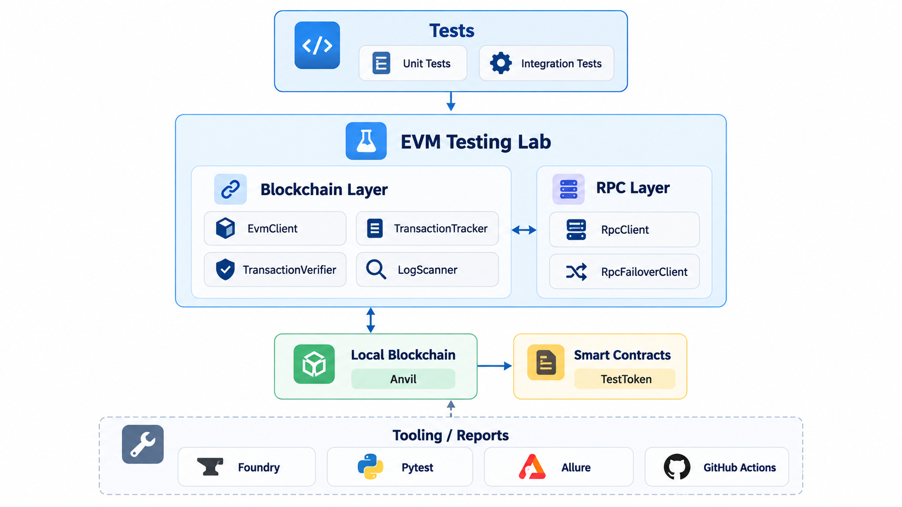
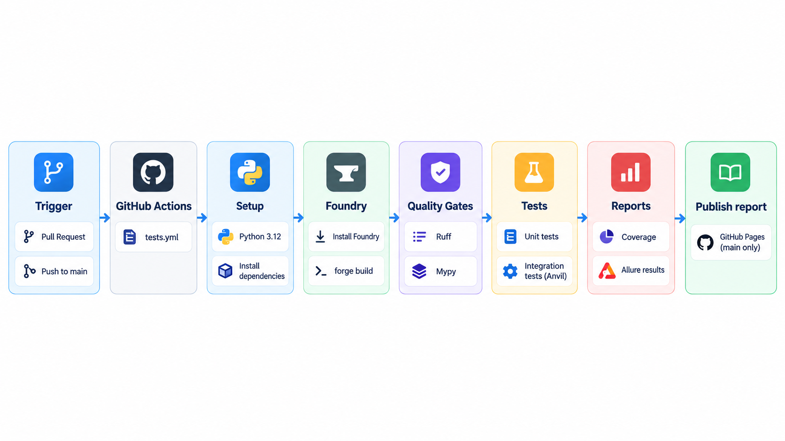

# EVM Testing Lab

[](https://github.com/Iar772/evm-testing-lab/actions/workflows/tests.yml)

A compact, EVM test automation project built with **Python 3.12**, **pytest**, **web3.py**, **Foundry**, **Anvil**, and **Allure**.

The repository demonstrates how I structure blockchain test infrastructure around clear responsibilities: JSON-RPC access, provider failover, transaction lifecycle tracking, receipt verification, chunked event-log scanning, deterministic local-chain isolation, and CI quality gates.

> **Latest Allure report:** https://iar772.github.io/evm-testing-lab/

---

## What this project demonstrates

- JSON-RPC abstraction with explicit response validation
- Transport error normalization and RPC provider failover
- Chain ID validation to detect wrong-network configuration
- Transaction receipt tracking and confirmation-depth waiting
- Separation of transaction tracking from transaction verification
- Chunked `eth_getLogs` scanning across fixed block ranges
- Fail-closed behavior for incomplete blockchain history
- Log deduplication by `(chain_id, transactionHash, logIndex)`
- ERC-20 integration testing against a real local EVM
- Test isolation with `evm_snapshot` / `evm_revert`
- Allure reporting for integration scenarios
- Ruff, mypy, pytest, coverage, Foundry build, and Anvil execution in GitHub Actions
- Published Allure HTML report through GitHub Pages

---

## Architecture



### Responsibility boundaries

```text
LogScanner
    -> decides which block ranges to scan
    -> aggregates results
    -> deduplicates logs

RpcFailoverClient
    -> decides which RpcClient/provider to try
    -> fails over only on transport-level failures

RpcClient
    -> performs one JSON-RPC request
    -> validates the response shape
    -> translates transport failures into RPCTransportError

TransactionTracker
    -> observes transaction lifecycle
    -> waits for receipts and confirmation depth

TransactionVerifier
    -> validates an already-observed receipt
    -> does not poll or talk to RPC providers
```

---

## Key design decisions

### Fail-closed log scanning

A successful `eth_getLogs` response containing `[]` means that no matching logs were found. A failed RPC request means something completely different: the data for that range is unknown.

The scanner therefore never converts a failed chunk into an empty list. If any chunk cannot be read, the whole scan fails instead of silently returning partial history.

### Tracker and verifier are separate

`TransactionTracker` is responsible for time-dependent observation: receipt waiting, polling, timeouts, and confirmation depth.

`TransactionVerifier` validates the receipt after it has been observed. This keeps lifecycle tracking separate from transaction-result policy and makes both components easier to test.

### Failover is transport-specific

`RpcFailoverClient` switches providers only for `RPCTransportError`-type failures. Programming errors, malformed responses, and regular JSON-RPC errors are not hidden by automatically trying another provider.

### Fixed block ranges over `latest`

Historical scans use explicit block numbers. Different providers may expose slightly different heads, so repeatedly using `latest` during failover can produce inconsistent observations.

### Deterministic test isolation

The ERC-20 contract is deployed once per test session. Each integration test runs from a clean baseline created with Anvil's `evm_snapshot` and restored with `evm_revert`.

This keeps integration tests fast without allowing mutable chain state to leak between tests.

---

## Tech stack

| Area | Tooling |
|---|---|
| Language | Python 3.12 |
| Test framework | pytest |
| EVM interaction | web3.py |
| Solidity toolchain | Foundry / Forge |
| Local blockchain | Anvil |
| Contract dependency | OpenZeppelin Contracts |
| Reporting | Allure |
| Linting | Ruff |
| Static typing | mypy |
| Coverage | pytest-cov |
| CI | GitHub Actions |
| Report hosting | GitHub Pages |

---

## Requirements

Install the following locally:

- Python `3.12.x`
- Foundry (`forge`, `anvil`, `cast`)
- Git

Allure CLI is optional locally because GitHub Actions generates and publishes the HTML report automatically.

---

## Installation

Clone the repository together with its Foundry submodules:

```bash
git clone --recurse-submodules https://github.com/Iar772/evm-testing-lab.git
cd evm-testing-lab
```

If the repository was already cloned without submodules:

```bash
git submodule update --init --recursive
```

Create and activate a virtual environment:

```bash
python3.12 -m venv .venv
source .venv/bin/activate
```

Install the project and development dependencies:

```bash
python -m pip install --upgrade pip
pip install -e ".[dev]"
```

Build Solidity contracts:

```bash
forge build
```

---

## Running tests

### Unit tests

Unit tests use mocks/fakes and do not require a running blockchain node.

```bash
pytest tests/unit -v
```

Run unit tests with coverage:

```bash
pytest tests/unit \
  --cov=evm \
  --cov-report=term-missing \
  --cov-report=xml
```

The repository uses an **85% minimum coverage quality gate** for the unit suite.

### Integration tests

Start Anvil in one terminal:

```bash
anvil
```

Then run the integration suite in another terminal:

```bash
pytest tests/integration -v
```

Integration tests exercise real interactions across:

```text
pytest -> web3.py -> JSON-RPC -> Anvil -> EVM contract
```

### Full test suite

With Anvil running:

```bash
pytest -v
```

---

## Code quality

Run the local quality gates with:

```bash
forge build
ruff check .
mypy src
pytest tests/unit --cov=evm --cov-report=term-missing --cov-report=xml
pytest tests/integration
```

The CI pipeline runs the same classes of checks on a clean GitHub-hosted runner.

---

## Allure reporting

Integration tests generate raw Allure results:

```bash
pytest tests/integration --alluredir=allure-results
```

The CI pipeline:

1. runs the integration suite;
2. stores raw `allure-results` as a workflow artifact;
3. generates the Allure HTML report on pushes to `main`;
4. publishes the latest report to GitHub Pages.

**Published report:** https://iar772.github.io/evm-testing-lab/

Raw Allure results remain downloadable from individual GitHub Actions runs for a limited retention period.

---

## CI pipeline



Pull requests run the quality gates and tests but do **not** overwrite the public Allure report. The Pages deployment happens only after a successful push to `main`.

---

## Test coverage highlights

The repository includes tests for:

- valid and malformed JSON-RPC responses;
- wrong-network detection;
- transaction receipt timeout handling;
- confirmation-depth boundaries and polling;
- successful and reverted transaction verification;
- inclusive log-scanner chunk boundaries;
- successful empty log chunks;
- fail-closed behavior when a middle chunk fails;
- log deduplication and multiple logs from the same transaction;
- RPC provider failover behavior;
- ERC-20 deployment, minting, transfers, balances, and events;
- multi-block confirmation behavior on Anvil;
- real `eth_getLogs` scanning against a deployed ERC-20 contract.

---

## Example blockchain flow

```text
Submit ERC-20 transaction
        |
        v
TransactionTracker
        |
        | receipt / confirmations
        v
TransactionVerifier
        |
        | status == 1
        v
Business assertions
        |
        +--> balances
        +--> Transfer event
```

A successful receipt is not treated as proof that the business outcome is correct. Integration tests separately validate state changes and emitted events.

---

## Scope

This repository intentionally stays focused on EVM test automation infrastructure.

It does **not** attempt to be a production indexer, wallet backend, or multi-chain analytics platform.
